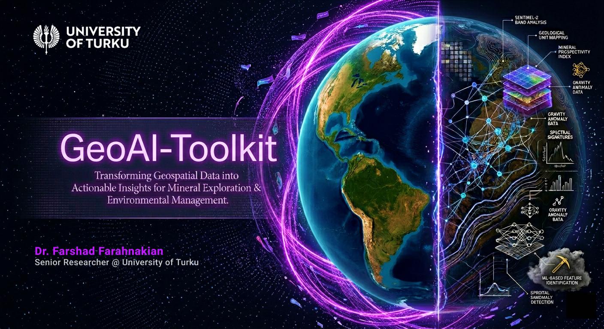
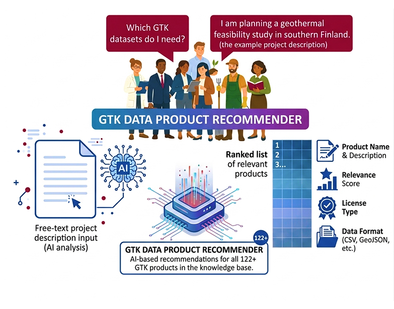
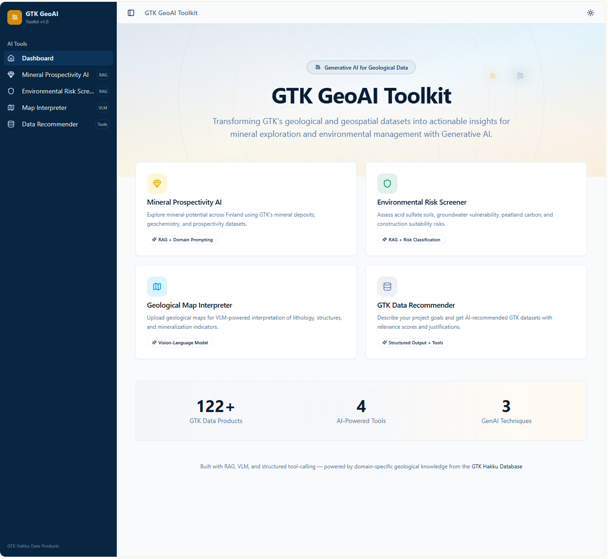

# 🛰️​🚨​​ GeoAI Toolkit

This repo shows how GenAI, multimodal LLMs/VLMs, GeoAI, and RAG can be applied to geological and geospatial workflows for knowledge extraction, map-grounded interaction, and exploration decision support. The projects are designed as practical prototypes for GTK data products and expert-facing use cases. 

This is a small concept of how AI Generative can be a digital solution for companies with a ton of datasets, like GTK.  

​💡✨​​ **Transforming Raw Data Into Actionable Insights** 📈​📊​🔍



## ⚡ Motivation 
The [Hakku service](https://hakku.gtk.fi/en), as the primary gateway to Finland's geological data, contains a staggering diversity of information, including 17,000 publications, 12,000 photographs, and over 3,000 hand-drawn maps, alongside thousands of high-resolution spatial datasets. To transform this "dark data" into actionable insights, the deployment of GenAI must move beyond simple conversational agents toward robust, spatially-aware systems capable of multimodal reasoning across text, imagery, and vector databases. 

## 📌➡️​​ Mapping GTK Hakku Data Products to Gen AI Tasks
The Hakku service provides a range of products that can be grouped by their primary data format and the corresponding AI task they enable. 

| Theme | Data Products | Format/Modality | Primary AI Task |
|---|---|---|---|
| **Bedrock & Geochemistry** | Drill core analysis (15k+ cores), whole-rock geochemical analyses, petrophysics. | Tabular (CSV), Vector (GPKG), Structured Database. | Text-to-Spatial SQL, Predictive Mineralogical Modeling. |
| **Publications & Reports** | Archive reports, map explanations, Finnish geological posters. | Unstructured PDF, Scanned Text. | Knowledge Graph (KG) Extraction, Semantic Search (RAG). |
| **Historical Records** | Hand-drawn maps (1850–1970), field photographs (1869–present). | Raster (TIFF, JPG), Visual Metadata. | Vision-Language Model (VLM) Captioning, OCR, Facies Recognition. |
| **Mineral Deposits** | Mineral Deposit Database (MDaE), commodity reserves, mine status. | Relational Data (Oracle/Postgres), Linked Tables. | Multi-agent reasoning for exploration decision support. |
| **Superficial Deposits** | Glacial features, peatland surveys, acid sulfate soils. | Raster (Elevation models), Vector (Polygons). | Foundation Model (FM) based classification and segmentation. |

## GeoAI Tools
Five AI-based services or tools are proposed based on the GTK data and required AI agents:
1. 🚧​⛏️ Mineral Prospectivity AI Assistant
2. 🌍​‼️ ​Environmental Risk Screener
3. 🗺️🔍​ ​Geological Map Interpreter
4. 📂​📇 GTK Data Product Recommender
5. 🧪​📊​ ​Geochemical Anomaly Explainer

### Tool 1️⃣​: Mineral Prospectivity AI Assistant
🎯​**Purpose:** Chat-based tool that answers questions about mineral exploration potential using GTK's mineral deposits, geochemistry, prospectivity modeling, and bedrock data.

✅​**Features:**
- Conversational AI chat where users ask questions like: "What critical minerals have been identified in the Kuusamo schist belt?" or "Compare the geochemical signatures of Cu-Au deposits in Pohjanmaa vs. Lapland?"
- Pre-loaded knowledge-based covering: Mineral deposits database, mineral prospectivity modeling, metallogenic areas, rock geochemistry, till geochemistry, bedrock maps, drill core archive.
- Suggested questions panel for quick start.
- All responses cite specific GTK data products and recommend datasets.
- Markdown-rendered responses with structured tables.

### Tool 2️⃣​: Environmental Risk Screener 
🎯​**Purpose:** AI Tool for environment management, assessing acid sulfate soils, groundwater vulnerability, and peatland carbon. 

✅​**Features:**
- Chat interface for environmental queries, such as: "What environmental risks should be assessed before construction in coastal Ostrobothnia?" or "How do acid sulfate soils in this region affect water quality?" or “What happens if mineral concentration increases?”
- Knowledge base covers: Acid sulfate soil, groundwater vulnerability, groundwater recharge potential, peatland carbon storage, peatland fertility levels, clay areas and depths, construction conditions of superficial deposits
- Risk assessment summaries with severity indicators
- Recommended GTK databases for each risk factor

### Tool 3️⃣: Geological Map Interpreter (VLM Demo)
🎯​**Purpose:** Upload a geological map image (or select from GTK sample maps) and use VLM to interpret structures and geological features. 

✅​**Features:**
- Image upload zone for geological map images
- Pre-loaded sample GTK map thumbnails (bedrock maps at various scales)
- VLM-powered analysis that identifies: rock types, structural features (faults, folds, lineaments), and potential mineralization indicators
- Side-by-side view: map image + AI interpretation panel

### Tool 4️⃣​: GTK Data Product Recommender
🎯​**Purpose:** Describe your project goals in natural language and get AI-recommended GTK datasets with justification. 

✅​**Features:**
- Input: Free-text project description (e.g., "I am planning a geothermal energy feasibility study in southern Finland")
- Output: Ranked list of relevant GTK products with: product name and description, relevant score, license type, and data format.
- Covers all 122 GTK products in the knowledge base


## Getting Started

Follow these instructions to get a copy of the project up and running on your local machine for development and testing purposes.

### Prerequisites

You will need **Node.js** installed on your system. This project was built using the LTS version of Node.

* **Download Node.js:** [https://nodejs.org/](https://nodejs.org/)
* **Verify Installation:**
  Open your terminal and run:
  ```bash
  node -v
  npm -v

### Installation & Setup
1. Navigate to the project directory. Open your terminal (PowerShell, Command Prompt, or Bash) and move into the toolkit folder:
```bash
  cd "C:\path/GeoAI Toolkit"
```
2. Install dependencies Run the following command to download all necessary packages listed in the `package.json` file:
```bash
  npm install
```
3. Run the development server. Once the installation is complete, start the local development server:
```bash
  npm run dev
```
The application should now be running! Check the terminal output for the local URL (usually `http://localhost:5173` or `http://localhost:3000`).

## Web-app overview 

